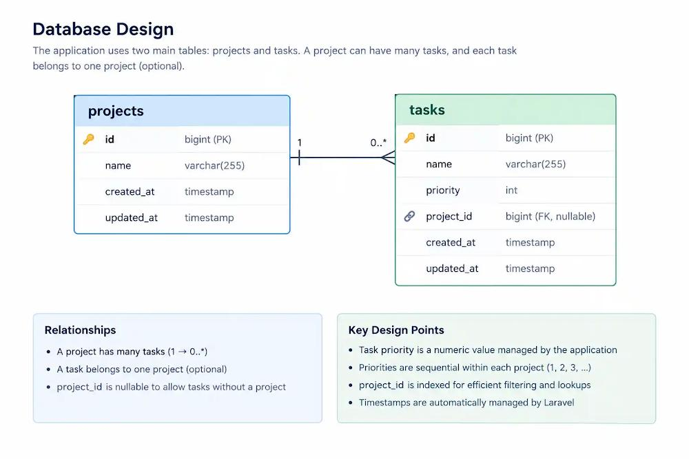
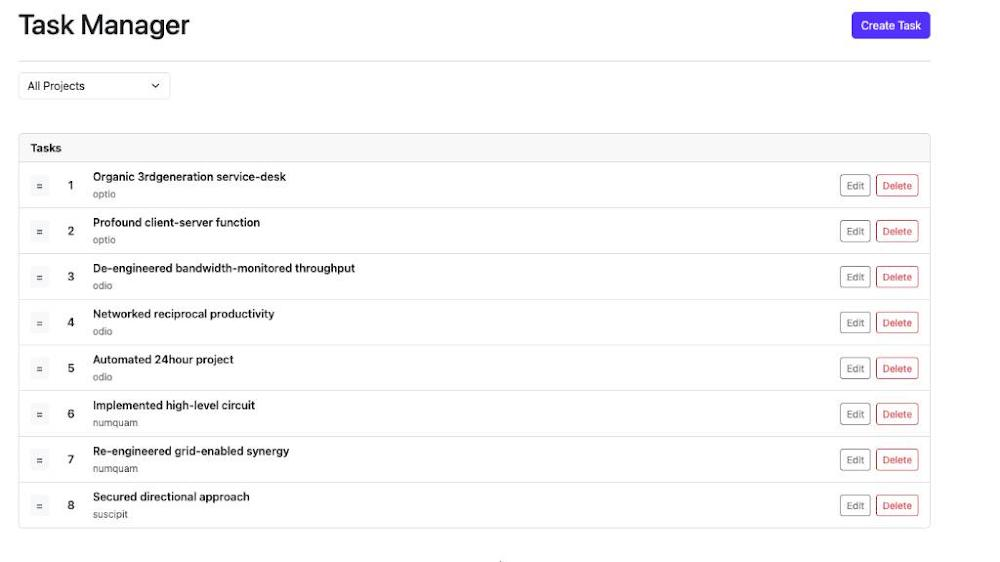
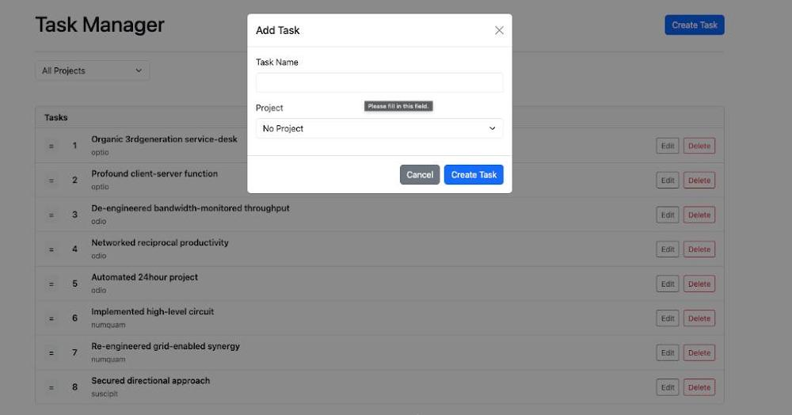
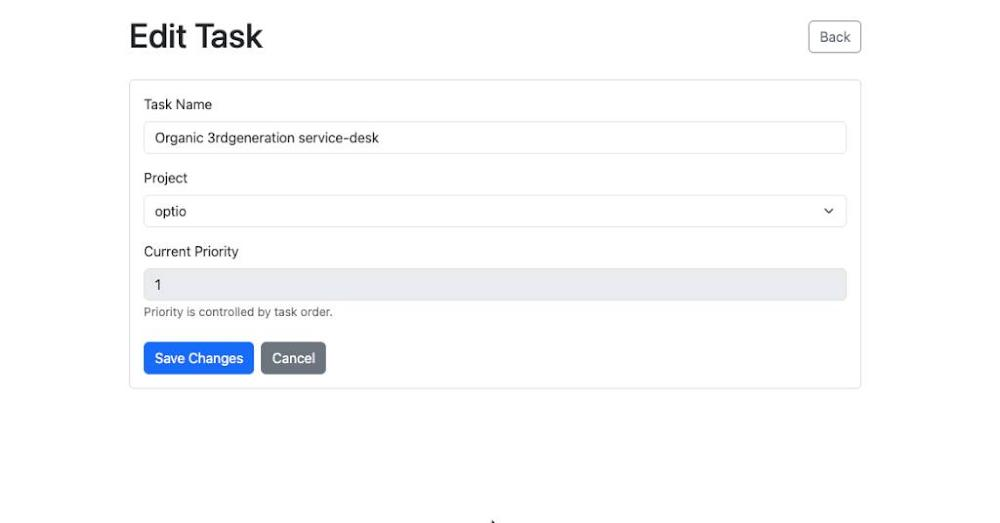

# Task Management Application

A simple, robust task management application built with **Laravel 11**, **PHP 8.3**, **MySQL**, and an interactive frontend powered by **Blade**, **Bootstrap 5**, **jQuery**, and **SortableJS**.

The application allows users to seamlessly create, edit, delete, filter, and dynamically reorder tasks. Task priority is automatically recalculated on the backend based on the drag-and-drop ordering on the frontend.

---

## 🚀 Features

### 📋 Task Operations
* **Create Tasks** – Add new tasks instantly with clean UI forms.
* **Edit Tasks** – Modify task titles and reassign project categories on the fly.
* **Delete Tasks** – Safely remove tasks with correct HTTP response lifecycles.

### 🔄 Dynamic Ordering & Context
* **Drag-and-Drop Reordering** – Move tasks visually using a seamless frontend interface.
* **Automatic Priority Management** – Order changes trigger instant, backend-recalculated priority mapping.
* **Database Transactions** – Bulk priority updates run inside strict database transactions for optimal data integrity.
* **Project Isolation** – Assign tasks to specific projects and filter lists instantly. Drag-and-drop actions are strictly scoped to the active project context.

### 🛡️ Architecture & Security
* **Server-Side Validation** – Robust Laravel Form Request validation safeguards incoming payloads.
* **Pest Test Suite** – Fully covered by feature tests ensuring regression-free changes.

---

## 🛠️ Tech Stack

### Backend
* [PHP 8.3+](https://www.php.net/)
* [Laravel 11.x](https://laravel.com/)
* [MySQL 8.0+](https://www.mysql.com/)
* Eloquent ORM & Laravel Form Requests

### Frontend
* [Blade Templates](https://laravel.com/docs/11.x/blade)
* [Bootstrap 5](https://getbootstrap.com/)
* [jQuery](https://jquery.com/)
* [SortableJS](https://sortablejs.github.io/Sortable/)
* [Vite Assets Bundler](https://vite.dev/)

### Testing
* [Pest Testing Framework](https://pestphp.com/) (Laravel Feature Tests)

---

## 📐 Technical Decisions

For a clean and minimal tech stack, the app utilizes server rendered Blade architecture and jQuery + SortableJS instead of heavier solutions like Livewire, React or Vue to avoid extra abstractions and complexity for a small-scale app while still providing a good UX with interactive drag-and-drop operations. On the backend, the app focuses on the data integrity and code separation by using Laravel Form Requests to keep validation logic separate from the controllers. Moreover, the task’s priority calculations are handled on the backend to keep database as a source of truth and wrapped in database transactions to ensure that either all priority changes and deletions propagate or none if an error occurs.

---

## 📂 Project Structure

```text
app/
├── Http/
│   ├── Controllers/
│   │   └── TaskController.php       # Handles core task operations & transaction reordering
│   └── Requests/
│       ├── StoreTaskRequest.php     # Validates incoming task payloads
│       └── UpdateTaskRequest.php    # Validates updates and modifications
└── Models/
    ├── Project.php                  # One-To-Many: Project has many Tasks
    └── Task.php                     # BelongsTo Project relationship code

database/
├── factories/                       # Blueprint models for seeding & Pest testing
├── migrations/                      # Tables setup for projects & sequenced tasks
└── seeders/                         # Dummy data for zero-config evaluation

resources/
├── css/
│   └── app.css
├── js/
│   ├── app.js                       # Entry point bundling Bootstrap & global modules
│   └── tasks.js                     # Implements SortableJS & AJAX payload sync
└── views/
    ├── layout/
    │   └── app.blade.php            # Primary structural template shell
    └── tasks/
        ├── index.blade.php          # Main dashboard view
        ├── edit.blade.php           # Focused editing interface
        └── partials/
            ├── task-rows.blade.php   # Reusable table line items for drag-and-drop
            └── create-task-modal.blade.php
```

---

## 📋 Database Design



---

## 🖥️ User Interface Screens

### Landing Page / Task Dashboard
Displays the active list of tasks with drag-and-drop reordering indicators, project filtering, and quick actions for editing or deleting tasks.


### Add Task Modal
Allows users to instantly add new tasks to the application, complete with inline field validation alerts.


### Edit Task Screen
A focused layout to modify a task's name, reassigned project category, and review its current sequence priority status.


---

## 💻 Installation & Local Setup

### 1. System Requirements
Ensure your workspace includes:
* **Composer**
* **Node.js & NPM**
* Active **MySQL** Service

### 2. Dependency Setup
```bash
# Install vendor dependencies
composer install
npm install
```

### 3. Application Configurations
```bash
# Set up environment workspace config
cp .env.example .env

# Generate encryption token key
php artisan key:generate
```

### 4. Database Initialization
Modify your local `.env` settings to target your MySQL instance:
```env
DB_CONNECTION=mysql
DB_HOST=127.0.0.1
DB_PORT=3306
DB_DATABASE=project_task_manager
DB_USERNAME=root
DB_PASSWORD=YOUR_PASSWORD_HERE
```

Apply schemas and generate seeded sample rows:
```bash
php artisan migrate --seed
```

### 5. Fire Up the Servers
Launch your local PHP instance:
```bash
php artisan serve
```
In a secondary terminal tab, spin up the Vite compiler:
```bash
npm run dev
```
Open your web browser and view the app at: **`http://127.0.0.1:8000`**

---

## 🧪 Running the Test Suite

This application enforces feature integrity through a highly readable **Pest** suite. 

```bash
# Execute the entire suite
php artisan test

# Alternatively, run via Pest directly
./vendor/bin/pest

# Run localized Task validation flows exclusively
./vendor/bin/pest tests/Feature/TaskManagementTest.php
```

### Coverage Assertions
* Task Creation & Validation rulesets
* Task Index Listing and Project filter queries
* Soft or complete data mutations (Update/Delete lifecycles)
* Dynamic ordering and priority updates
